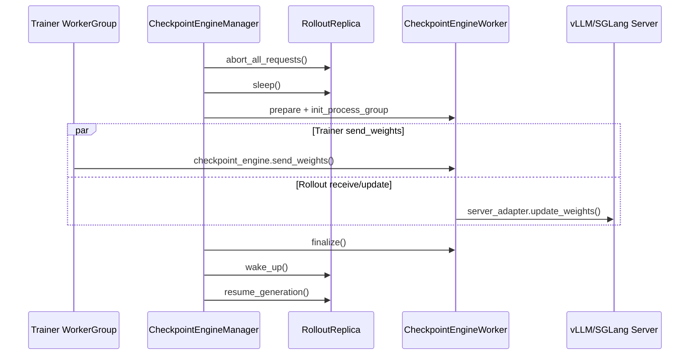
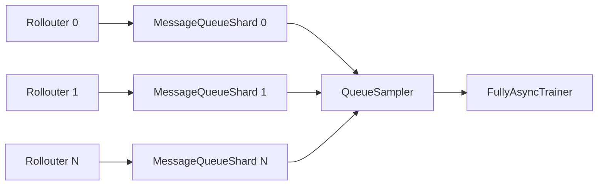

# verl Ascend 支持版本推理优化代码级设计文档

日期：2026-05-20  
工作目录：`/Users/xiongbowen/Documents/pink's_project`  
Ascend 支持基线：`verl-project/verl@4045d67063052dcb800c918c107b8d5a87046006`

## 0. 结论先行

当前不能直接把 GitHub `main` 当成“昇腾支持的最新版 verl”。`main` 里的最新 Ascend Docker recipe 才是支持关系的入口，而 recipe 明确把 verl 源码固定到 `4045d67063052dcb800c918c107b8d5a87046006`。因此本文以本地拉取的 `verl-ascend-supported-4045d670` 为代码分析基线。

本地代码位置：

- Ascend 支持基线源码：`/Users/xiongbowen/Documents/pink's_project/verl-ascend-supported-4045d670`
- GitHub main 源码及 Ascend Docker 证据：`/Users/xiongbowen/Documents/pink's_project/verl-main-full/verl-main`

外部版本关系：

- `docker/ascend/Dockerfile.ascend_8.5.2_a3_qwen3-5` 使用 CANN `8.5.2`、vLLM `v0.18.0`、vLLM-Ascend commit `54879467c41784a446aa5b486a391d9bfbf488fa`、`torch==2.9.0`、`torch_npu==2.9.0`，并在安装 verl 时执行 `git checkout 4045d67063052dcb800c918c107b8d5a87046006`。
- `docker/ascend/Dockerfile.ascend_8.5.2_a2_qwen3-5` 同样固定到该 verl commit。
- `docs/ascend_tutorial/get_start/install_guidance.rst` 指向 vLLM/vLLM-Ascend `v0.18.0`，同时说明 Ascend IPC 需要 HDK `>=25.3.rc1` 和 CANN `>=8.3.RC1`。

## 1. 现有权重同步链路

### 1.1 当前主路径



关键代码：

- `CheckpointEngineManager.update_weights()`：`verl/checkpoint_engine/base.py:404`
- abort/sleep/update/finalize/wake/resume 串行流程：`verl/checkpoint_engine/base.py:416-445`
- 本地缓存抽象已存在但未被 HCCL 实现：`CheckpointEngineWithCache`，`verl/checkpoint_engine/base.py:180`
- vLLM adapter 的 IPC/SHM 权重更新：`verl/workers/rollout/vllm_rollout/vllm_rollout.py:154`
- bucket IPC 传输：`verl/workers/rollout/vllm_rollout/bucketed_weight_transfer.py:161`

### 1.2 必须先修的 P0 问题

`HCCLCheckpointEngine` 当前注册为 `"nccl"`，而 rollout config 注释和用户预期是 `backend=hccl`。同目录里 `NCCLCheckpointEngine` 也注册 `"nccl"`，这会导致：

1. `backend=hccl` 找不到实现。
2. `"nccl"` 注册存在覆盖/歧义风险。
3. 后续所有基于 HCCL 的优化开关都可能无法正确命中。

代码位置：`verl/checkpoint_engine/hccl_checkpoint_engine.py:96`

建议第一步补丁：

```python
@CheckpointEngineRegistry.register("hccl")
class HCCLCheckpointEngine(CheckpointEngine):
    ...
```

同时补单元测试：构造 `CheckpointEngineRegistry.new("hccl", ...)`，确保 NPU 环境下能实例化；无 NPU CI 环境可用 mock import 方式只验证 registry。

## 2. 方案 3.1：异步权重同步与流水线预加载

### 可行性判断

可落地，但不能按“直接加 `torch_npu.npu.Stream()` 就完成”的方式做。当前 Ascend 支持基线已经有三块可复用基础：

- `CheckpointEngineWithCache` 抽象已描述“不中断 rollout 请求，先同步到本地缓存，请求耗尽后再取权重”。
- `fully_async_policy` 已有 `async_training.staleness_threshold` 新鲜度控制。
- vLLM rollout 已是 actor/server 常驻，`update_weights_from_ipc` 通过 non-block future 和 sender 传输并行协作。

但当前实际链路仍有强阻塞：

- `CheckpointEngineManager.update_weights()` 会先 `abort_all_requests()`，再 `sleep_replicas()`，同步完成后才 `resume_generation()`。
- HCCL `BroadcastOperation` 的 docstring 写“async”，但 `__init__` 里直接调用 `_run()`，实际是同步执行 `pyhccl.broadcast()`。
- `send_weights()` 在每个 bucket 切换前调用 `torch.npu.synchronize()`。

### 设计目标

将权重同步拆成两阶段：

1. `prefetch_weights_to_cache(version)`：训练侧把新权重异步广播/传输到 rollout 侧影子缓存，不中断正在生成的请求。
2. `commit_cached_weights(version)`：在 replica 请求边界或 staleness 达到阈值时暂停接收新请求，短暂停机把缓存权重加载进推理引擎。

### 推荐代码改造

新增类：

- `verl/checkpoint_engine/hccl_cached_checkpoint_engine.py`
  - `class HCCLCachedCheckpointEngine(CheckpointEngineWithCache)`
  - 复用 HCCL bucket meta + device uint8 bucket。
  - rollout 侧不直接 yield 到 server adapter，而是写入 `WeightCacheStore`。

新增缓存对象：

- `WeightCacheStore`
  - key：`param_version`
  - value：按 bucket 保存的 NPU tensor 或 pinned CPU/SHM fallback。
  - 状态：`RECEIVING -> READY -> COMMITTED -> RELEASED`
  - 支持 `max_cached_versions=1`，默认只保留最新版本，避免 HBM 爆炸。

改造 `CheckpointEngineManager`：

- 新增 `prefetch_weights(global_steps)`，只创建 worker group、build process group、触发 CE 接收并写 cache，不调用 `abort_all_requests()` 和 `sleep_replicas()`。
- 新增 `commit_weights(global_steps)`，在 rollout request 边界调用 `server_adapter.update_weights(checkpoint_engine.get_weights(version))`。
- 对 fully_async：`FullyAsyncTrainer._fit_update_weights()` 先触发 prefetch；`FullyAsyncRollouter.reset_staleness()` 或 `_should_pause_generation` 满足条件时 commit。

关键伪代码：

```python
async def prefetch_weights(self, global_steps: int):
    rollout = self._build_rollout_worker_group()
    self.build_process_group(rollout)
    ray.get(
        self.trainer.prefetch_weights(global_steps=global_steps)
        + rollout.prefetch_weights(global_steps=global_steps)
    )

async def commit_weights(self, global_steps: int):
    await asyncio.gather(*[r.pause_accepting_new_requests() for r in self.replicas])
    ray.get(rollout.commit_cached_weights(global_steps=global_steps))
    await asyncio.gather(*[r.resume_generation() for r in self.replicas])
```

### NPU Stream 使用边界

可以在 HCCL engine 内部增加独立 stream，但要先确认 `pyhccl.broadcast()` 是否绑定当前 NPU stream，或是否只能使用默认 stream。设计上应做成能力探测：

- 若 `pyhccl.broadcast` 支持当前 stream：使用 `torch_npu.npu.Stream()` + event 管理 bucket 生命周期。
- 若不支持：只做“异步 actor task + cache prefetch”，仍可与 rollout 计算重叠，但不能声称算子流级完全重叠。

### 风险

- 算法侧 off-policy 风险由 `staleness_threshold` 控制。建议默认 `0.1-0.5`，大模型吞吐压测通过后再增大。
- 影子缓存占 HBM。千亿模型不应缓存全量两份权重，推荐按 bucket 或 layer 分段 commit。
- vLLM/SGLang 对在线更新权重的一致性要求不同，需要分别做 server adapter 层验证。

## 3. 方案 3.2：同节点零拷贝权重共享与显存重映射

### 可行性判断

部分可落地，但原方案里“通过 `aclrtIpcOpenMemHandle` 让推理进程长期挂载训练进程物理显存，从而降低 50% 显存占用”的目标，在当前 verl Ascend 支持基线中没有现成落点，风险高，不能作为第一阶段承诺。

当前已有的是“传输用 IPC”，不是“长期共享权重存储”：

- `VLLMRollout` 用 `is_support_ipc()` 判断是否支持 IPC，不支持则 fallback 到 CPU shared memory。
- `BucketedWeightSender` 在 `use_shm=False` 时通过 `torch.multiprocessing.reductions.reduce_tensor(buffer)` 传递设备 IPC handle。
- `BucketedWeightReceiver` 通过 `rebuild_ipc(handle, device_id)` 重建 buffer，但随后对 tensor 做 `clone()`，注释说明这样是为了释放 IPC memory。

也就是说，现在的代码是“用 IPC buffer 加速跨进程权重更新”，最终推理引擎仍有自己的权重副本。

### 推荐落地路径

第一阶段：增强现有 IPC bucket 传输。

- 保持 `BucketedWeightSender/Receiver` 抽象。
- 增加 Ascend IPC 能力日志和 fallback 指标：
  - `ipc_supported`
  - `use_shm`
  - `bucket_copy_time`
  - `receiver_clone_time`
- 对 NPU 环境明确要求 HDK `>=25.3.rc1`、CANN `>=8.3.RC1`。
- 不改 vLLM 权重所有权，仅降低传输延迟和 host memory 峰值。

第二阶段：PoC 原生 ACL IPC handle。

- 新增 `AscendIpcHandleProvider`，封装 `aclrtIpcGetMemHandle` / `aclrtIpcOpenMemHandle` / close 逻辑。
- 只对独立 bucket buffer 做 PoC，不直接映射模型参数。
- 先验证生命周期、安全隔离、进程退出清理、跨 device 可见性、torch_npu allocator 兼容性。

第三阶段：研究长期共享权重。

必须满足：

- vLLM-Ascend/SGLang 可以接受外部 storage 或参数 view。
- 推理侧不要求对权重 tensor 拥有 allocator 生命周期。
- 训练侧 optimizer step 不会原地破坏推理中正在读的版本。
- 有版本化只读快照或 copy-on-write 策略。

### 不建议直接做的点

- 不建议把训练参数原地暴露给推理进程长期读取。训练 optimizer step 与推理读权重之间会出现一致性问题。
- 不建议承诺 50% HBM 节省。当前代码 clone 后仍保留推理权重副本，真实收益主要是传输链路和 host memory 峰值。

## 4. 方案 3.3：分布式调度引擎优化

### 可行性判断

可落地，而且当前代码已经朝“长寿命 Actor”方向演进。主干 PPO/rollout 不再是每条样本一个 Ray task 的风格，vLLM/SGLang server、rollout replica、trainer worker group 都是长寿命对象。

不过 fully_async 仍有两个瓶颈：

- `MessageQueue` 是单 Ray Actor：`@ray.remote(num_cpus=2, max_concurrency=20)`，内部 `deque` 存样本。
- rollouter put 时 `ray.cloudpickle.dumps(rollout_sample)`，trainer get 后 `ray.cloudpickle.loads(x)`，整样本序列化仍在。

TransferQueue 也已经出现在该基线中，但更像“外部系统集成入口”，不是完整 in-tree 实现：

- `verl/trainer/main_ppo.py:69` 在 `config.transfer_queue.enable` 时设置 `TRANSFER_QUEUE_ENABLE=1`。
- `docs/data/transfer_queue.md` 描述 TransferQueue 用于把控制流和数据流解耦，支持 sample-level metadata、分布式 storage unit，并提到 Ascend native data system Yuanrong。
- 本地 `verl/experimental/transfer_queue` 目录不存在，说明该 commit 中代码实现依赖外部包或后续集成，不应假设已完整内置。

### 推荐设计

1. Ray GCS 参数压降

建议在启动脚本或 `ray_init.runtime_env.env_vars` 注入：

```bash
RAY_task_events_max_num_task_in_gcs=100
RAY_enable_record_actor_task_log=false
RAY_event_stats=false
```

实际变量名需按目标 Ray 版本复核，避免无效配置静默失效。更稳妥方式是在启动日志里打印 Ray version 和生效 env。

2. MessageQueue 分片

将单 actor queue 改为 shard queue：



改造点：

- `fully_async_main.py` 创建 `MessageQueueShard` 列表。
- `FullyAsyncRollouter` 按 `sample_id % num_shards` put。
- `FullyAsyncTrainer._get_samples_from_queue()` 从 `QueueSampler` 批量取 metadata。
- 每个 shard 内保留 `asyncio.Condition`，但 get 接口改成 `get_samples(max_n)`，减少 Ray RPC 次数。

3. TransferQueue 替换整样本队列

把 Ray queue 中的数据从 `cloudpickle bytes` 改为轻量引用：

```python
SampleRef = {
    "sample_id": str,
    "param_version": int,
    "fields": {
        "input_ids": "tq://...",
        "responses": "tq://...",
        "logprobs": "tq://..."
    }
}
```

Trainer 只通过 Ray 收 metadata，tensor 字段由 TransferQueue storage 传输。

### 预期收益

- 降低 GCS 和单 actor mailbox 压力。
- 减少整样本 pickle/unpickle CPU 峰值。
- 更适合 64 节点以上场景，和文档中 TransferQueue “64 nodes, 1024 cards” 的方向一致。

## 5. 方案 3.4：状态字典序列化开销压降

### 可行性判断

需要拆成“权重同步”和“经验样本传输”两类看。

权重同步方面，该 Ascend 支持基线已经不再是简单 Pickle 全量 state_dict：

- HCCL/NCCL checkpoint engine 按 bucket 传输 tensor。
- vLLM rollout 使用 bucketed IPC/SHM。
- SGLang rollout 使用 bucket 分批更新。

真正仍然重的是 fully_async 经验样本：

- rollouter：`ray.cloudpickle.dumps(rollout_sample)`
- trainer：`ray.cloudpickle.loads(x)`
- `MessageQueue` actor 内部存 `deque`，队列满时丢弃 oldest sample。

### 推荐设计

1. 状态字典“脱水”规范化

对权重生成器统一增加轻量规范：

```python
def iter_transferable_params(named_params):
    for name, tensor in named_params:
        tensor = tensor.detach()
        if tensor.is_sparse:
            raise NotImplementedError("sparse param transfer is not supported")
        if not tensor.is_contiguous():
            tensor = tensor.contiguous()
        yield name, tensor
```

注意：`contiguous()` 会复制，不应无条件在所有路径开启。建议只在 bucket sender 检测到非连续 tensor 时做，并打指标。

2. WeightManifest

不要用 pickle 发送复杂对象，改为 JSON/msgpack 级 metadata：

```python
{
  "version": 123,
  "bucket_id": 8,
  "is_last": false,
  "tensors": [
    {"name": "...", "shape": [4096, 4096], "dtype": "bfloat16", "offset": 0}
  ]
}
```

数据面只传 uint8 bucket。HCCL 当前用 ZMQ `send_pyobj` 传 bucket meta，可替换成 manifest 编码，降低 Python pickle 风险。

3. RolloutSample 字段级 TransferQueue

把 `RolloutSample` 拆成：

- 控制面：`sample_id`、`param_version`、`reward_status`、长度信息。
- 数据面：`DataProto.batch` 中 tensor 字段。
- 非 tensor 小字段：保留 Ray 传输或 JSON。

Trainer 组 batch 时按字段 fetch，而不是 loads 整个 sample。

### 与 Ray Pickle5 的关系

Ray 对 numpy/arrow/tensor 有零拷贝或 plasma/object store 优化，但 Python 对象图越复杂，越容易退化到 cloudpickle。当前 `RolloutSample` 是复合对象，里面包含 `DataProto`、tensor dict、non_tensor_batch、状态字段，直接 cloudpickle 不稳定。更可靠的落地方式是“显式字段化 + 引用传递”。

## 6. 分阶段交付计划

### Phase 0：基线修正与可观测性

- 修复 `HCCLCheckpointEngine` registry 为 `"hccl"`。
- 在启动日志打印 Ascend support baseline：verl commit、CANN、torch_npu、vLLM-Ascend commit。
- 为权重同步打点：
  - `param_sync/abort_time`
  - `param_sync/sleep_time`
  - `param_sync/build_pg_time`
  - `param_sync/send_time`
  - `param_sync/server_update_time`
  - `param_sync/wake_resume_time`

### Phase 1：低风险优化

- 启用/验证 `fully_async_policy` 的 `staleness_threshold` 和 `trigger_parameter_sync_step`。
- 将 `MessageQueue.get_sample()` 扩展为 `get_samples(n)`，减少 Ray RPC。
- HCCL/ZMQ metadata 从 `send_pyobj` 改为 manifest 编码。
- 对 bucket sender 加非连续 tensor 检测和按需 `contiguous()`。

### Phase 2：异步预加载

- 实现 `HCCLCachedCheckpointEngine`。
- `CheckpointEngineManager` 增加 `prefetch_weights()` 与 `commit_weights()`。
- rollout 侧在请求边界 commit cached weights。
- 与 fully_async staleness 联动。

### Phase 3：TransferQueue 化经验样本

- 引入 `SampleRef`。
- Rollouter 写 tensor 字段到 TransferQueue storage。
- Trainer 根据 metadata fetch 并 assemble batch。
- MessageQueue 只保留 metadata。

### Phase 4：Ascend 原生 IPC PoC

- 用 ACL IPC handle 只验证 bucket buffer，不碰模型权重长期 ownership。
- 验证成功后再评估 vLLM-Ascend/SGLang 是否支持长期外部权重 view。

## 7. 方案可行性表

| 方案 | 当前基线支持程度 | 可落地等级 | 关键结论 |
| --- | --- | --- | --- |
| 3.1 异步权重同步与流水线预加载 | 有 cache 抽象和 fully_async staleness，但当前 update 链路仍阻塞 | 高，需改 manager + engine | 推荐做 prefetch/commit 两阶段，不直接承诺 NPU stream 完全重叠 |
| 3.2 同节点零拷贝权重共享 | 已有 IPC bucket transfer，非长期共享权重 | 中 | 第一阶段做 IPC 传输增强；长期 HBM 共享需单独 PoC |
| 3.3 Ray 调度优化 | 已有长寿命 actor，但 fully_async MessageQueue 单点明显 | 高 | 分片 queue + batch get + TransferQueue metadata 化 |
| 3.4 序列化压降 | 权重侧已 bucket 化；样本侧仍 cloudpickle 整对象 | 高 | SampleRef + TransferQueue 字段级传输最符合当前方向 |

## 8. 最小可执行补丁清单

1. `verl/checkpoint_engine/hccl_checkpoint_engine.py`
   - `@CheckpointEngineRegistry.register("nccl")` 改为 `@CheckpointEngineRegistry.register("hccl")`。

2. `verl/checkpoint_engine/base.py`
   - 给 `CheckpointEngineManager.update_weights()` 分段计时。
   - 新增可选 `async_prefetch_enabled` 分支，先不改变默认行为。

3. `verl/experimental/fully_async_policy/message_queue.py`
   - 新增 `get_samples(max_n)`。
   - 新增 queue shard id 和批量统计。

4. `verl/experimental/fully_async_policy/fully_async_trainer.py`
   - `_get_samples_from_queue()` 使用批量 get。
   - 增加 `cloudpickle.loads` 计时。

5. `verl/workers/rollout/vllm_rollout/bucketed_weight_transfer.py`
   - 增加 IPC/SHM 路径指标。
   - 对非连续 tensor 按需 contiguous。
   - receiver clone 计时。

6. 新增 `verl/checkpoint_engine/hccl_cached_checkpoint_engine.py`
   - 实现 `CheckpointEngineWithCache`，作为 Phase 2 功能开关。

## 9. 验证矩阵

| 验证项 | 方法 | 通过标准 |
| --- | --- | --- |
| HCCL backend 注册 | registry 单测或 NPU smoke test | `backend=hccl` 正确实例化 |
| IPC 支持判断 | 打印 HDK/CANN/torch_npu 版本 | NPU 环境符合阈值时 `use_shm=False` |
| 权重同步耗时拆解 | 运行一次 PPO/GRPO step | 能看到 abort/sleep/send/update/wake 分段指标 |
| fully_async 队列吞吐 | 采样 1k/10k sample | Ray RPC 次数下降，queue actor CPU 降低 |
| stale 样本比例 | 记录 `param_version` 差值 | 满足配置阈值，不出现不可控旧样本 |
| TransferQueue 样本传输 | 对比 cloudpickle 路径 | CPU memory 峰值和序列化耗时下降 |

## 10. 总体建议

最优先做的不是 3.2 的 ACL 显存重映射，而是：

1. 修正 HCCL registry。
2. 把当前权重同步路径的阻塞点量化。
3. 基于 `fully_async_policy` 先启用 staleness 和批量队列。
4. 再实现 HCCL cache prefetch/commit。
5. 最后用 TransferQueue 替换 fully_async 的整样本 cloudpickle。

这样路线最贴近当前 Ascend 支持基线，工程风险最低，也最容易拿到可证明的吞吐收益。

## 11. 面向推理性能团队的可落地优化包

这一节把“能做”进一步收敛成推理性能团队可以真实交付的框架层优化包。筛选标准是：

- 不要求改 PPO/GRPO 算法正确性。
- 不要求修改 vLLM-Ascend/SGLang 内核。
- 能在 verl 框架层通过配置、adapter、通信、队列、缓存策略拿到收益。
- 每个优化都有明确代码入口和验收指标。

### 11.1 P0：Ascend 权重同步链路修正与打点

落地等级：必须做。  
收益类型：让后续优化可用、可测、可归因。

当前问题：

- `HCCLCheckpointEngine` 注册成 `"nccl"`，与 `CheckpointEngineConfig` 注释中的 `"hccl"` 不一致。
- `CheckpointEngineManager.update_weights()` 当前把 abort、sleep、build process group、send/update、finalize、wake/resume 混在一个大耗时里。
- vLLM IPC/SHM fallback 只打 warning，没有形成指标，线上很难知道到底走了 IPC 还是 CPU shared memory。

代码入口：

- `verl/checkpoint_engine/hccl_checkpoint_engine.py:96`
- `verl/checkpoint_engine/base.py:404`
- `verl/workers/rollout/vllm_rollout/vllm_rollout.py:100`
- `verl/workers/rollout/vllm_rollout/bucketed_weight_transfer.py:102`

设计：

1. 修 registry：`register("hccl")`。
2. 在 `CheckpointEngineManager.update_weights()` 增加分段 timer。
3. 在 `VLLMRollout.__init__()` 记录 `ipc_supported/use_shm/device_uuid/torch_npu_version/cann_version`。
4. 在 `BucketedWeightSender/Receiver` 记录：
   - bucket 数量
   - bucket bytes
   - send/recv wait 时间
   - receiver clone/to(device) 时间
   - 非连续 tensor 次数

验收：

- `backend=hccl` 能启动。
- 每次参数同步能输出完整拆解指标。
- 能明确判断瓶颈在 sleep、HCCL broadcast、IPC clone、server update 还是 Ray 调度。

### 11.2 P1：权重同步的“小停顿 commit”优化

落地等级：高。  
收益类型：减少推理暂停时间，提升 rollout 有效吞吐。

当前 `update_weights()` 会先 `abort_all_requests()`，再 `sleep_replicas()`。vLLM server 侧 `abort_all_requests()` 会调用 `pause_generation(wait_for_inflight_requests=False, clear_cache=True)`，这会中断正在跑的请求并清 prefix cache。这个策略安全但粗暴。

代码入口：

- `verl/checkpoint_engine/base.py:416-445`
- `verl/workers/rollout/vllm_rollout/vllm_async_server.py:606`
- `verl/workers/rollout/vllm_rollout/vllm_async_server.py:969`
- `verl/workers/rollout/replica.py:281`

设计：

新增权重同步策略枚举：

```yaml
actor_rollout_ref:
  rollout:
    checkpoint_engine:
      sync_policy: abort_all | drain_then_commit | prefetch_then_commit
      drain_timeout_ms: 200
      clear_prefix_cache_on_update: false
```

三种策略：

- `abort_all`：保持当前默认行为，用于保守回退。
- `drain_then_commit`：先暂停接收新请求，等待 in-flight requests drain；超时后再 abort 少量尾部请求。
- `prefetch_then_commit`：先把权重传到本地缓存，等请求边界再短暂停机加载。

第一阶段只做 `drain_then_commit`：

```python
await replica.pause_accepting_new_requests()
drained = await replica.wait_for_requests_to_drain(timeout_ms=drain_timeout_ms)
if not drained:
    await replica.abort_all_requests(reset_prefix_cache=False)
await rollout.update_weights(...)
await replica.resume_generation()
```

验收：

- `param_sync/paused_ms` 小于当前 `abort+sleep+wake` 总耗时。
- 同等 step 下 aborted request 数下降。
- prefix cache hit rate 不因每次同步被清零而明显下降。

风险：

- 若模型权重更新必须清 KV/prefix cache，则 `clear_prefix_cache_on_update=false` 可能产生一致性风险。推荐默认仍清 cache，只在验证 vLLM-Ascend 权重版本隔离后放开。

### 11.3 P1：Bucket 化权重传输增强

落地等级：高。  
收益类型：降低权重更新耗时和内存峰值。

当前 `BucketedWeightSender` 存在几个明确优化点：

- 单个 tensor 超过 bucket 会直接 assert，代码里也留了 `TODO: slice embedding layer weight into chunks`。
- 每个 bucket 发送前 `get_torch_device().synchronize()`，会放大同步开销。
- metadata 用 `send_pyobj`，仍依赖 Python pickle。
- receiver 在 IPC 路径上 `clone()`，但没有统计 clone 成本。

代码入口：

- `verl/workers/rollout/vllm_rollout/bucketed_weight_transfer.py:128`
- `verl/workers/rollout/vllm_rollout/bucketed_weight_transfer.py:135`
- `verl/workers/rollout/vllm_rollout/bucketed_weight_transfer.py:146`
- `verl/workers/rollout/vllm_rollout/bucketed_weight_transfer.py:246`

设计：

1. 大 tensor 分片：

```python
for chunk_id, chunk in iter_tensor_chunks(weight, max_bytes=bucket_free_bytes):
    bucket_meta[f"{name}::chunk::{chunk_id}"] = ...
```

receiver 侧在 `on_bucket_received` 前重组，或更推荐把 chunk 直接交给 server adapter 做分片 load，避免额外拼接。

2. bucket size 自适应：

新增配置：

```yaml
checkpoint_engine:
  update_weights_bucket_megabytes: 2048
  auto_tune_bucket_size: true
  bucket_size_candidates_mb: [512, 1024, 2048, 4096]
```

启动前 3 次 sync 做轻量 profile，选择吞吐最高且不触发 OOM 的 bucket size。

3. manifest 替代 `send_pyobj`：

把 `shape/dtype/offset/is_last` 编码成 JSON/msgpack，避免 pickle 对复杂对象的额外 CPU 成本。

验收：

- embedding/lm_head 等大 tensor 不再要求用户手动增大 bucket。
- bucket 平均带宽提升。
- Python serialization 时间下降。

### 11.4 P1：Rollout 请求队列与 Ray RPC 粒度优化

落地等级：高。  
收益类型：降低 Ray actor 压力，提高短请求场景吞吐。

fully_async 当前的 `MessageQueue` 是单 actor，trainer 用同步循环逐个 `get_sample_sync()` 拉样本，rollouter 每个 sample 做一次 `put_sample()`。这在大量短 rollout 下很容易把 Ray RPC 和 actor mailbox 打满。

代码入口：

- `verl/experimental/fully_async_policy/message_queue.py:26`
- `verl/experimental/fully_async_policy/message_queue.py:55`
- `verl/experimental/fully_async_policy/message_queue.py:228`
- `verl/experimental/fully_async_policy/fully_async_trainer.py:244`
- `verl/experimental/fully_async_policy/fully_async_rollouter.py:510`

设计：

1. 批量 put/get：

```python
async def put_samples(self, samples: list[Any]) -> QueueStats:
async def get_samples(self, max_n: int, timeout_ms: int) -> tuple[list[Any], int]:
```

2. 分片 MessageQueue：

- shard 数默认等于 rollout replica 数或节点数。
- rollouter 按 `sample_id % num_shards` 写。
- trainer round-robin 或按 queue size 加权拉。

3. 背压策略：

当前 queue 满了会 `popleft()` 丢 oldest。对于 RL 训练更可控的策略是按 `param_version` 丢最旧版本样本：

```python
drop_policy: oldest | oldest_param_version | reject_new
```

验收：

- Ray RPC 调用数下降。
- MessageQueue actor CPU 降低。
- queue 满时 stale sample 比例受控。

### 11.5 P1：RolloutSample 的引用化传输

落地等级：高，但需要引入外部 TransferQueue 包。  
收益类型：降低 CPU 序列化、内存峰值和 Ray object store 压力。

当前 fully_async 的样本路径是：

- rollouter：`ray.cloudpickle.dumps(rollout_sample)`
- trainer：`ray.cloudpickle.loads(x)`

这对大 batch、长 response、多模态字段都会变成瓶颈。

代码入口：

- `verl/experimental/fully_async_policy/fully_async_rollouter.py:510`
- `verl/experimental/fully_async_policy/fully_async_trainer.py:276`
- `verl/trainer/main_ppo.py:69`
- `docs/data/transfer_queue.md`

设计：

新增 `SampleRef`：

```python
@dataclass
class SampleRef:
    sample_id: str
    param_version: int
    storage_backend: str
    tensor_refs: dict[str, str]
    non_tensor_meta: dict[str, Any]
```

Rollouter 将 tensor 字段写入 TransferQueue，Ray queue 只传 `SampleRef`。Trainer assemble batch 时按 ref 拉取 tensor。

第一阶段不用一次性覆盖所有字段，只迁移最大 tensor 字段：

- `input_ids`
- `responses`
- `attention_mask`
- `position_ids`
- `old_log_probs` 或 rollout logprob

验收：

- `cloudpickle.dumps/loads` 耗时下降。
- Ray object store 内存下降。
- Trainer 端 batch assemble 时间不回退。

### 11.6 P2：Prefix/KV Cache 保留策略

落地等级：中高。  
收益类型：减少权重同步后的 cache 冷启动损失。

当前 vLLM adapter 在权重更新后会 `clear_kv_cache()`，server 内部实际调用 `engine.reset_prefix_cache()`。这保证一致性，但如果 rollout prompt 有大量共享前缀，每次参数同步都会损失 prefix cache。

代码入口：

- `verl/workers/rollout/vllm_rollout/vllm_rollout.py:177`
- `verl/workers/rollout/vllm_rollout/vllm_async_server.py:595`
- `verl/workers/rollout/vllm_rollout/vllm_async_server.py:631`

设计：

新增配置：

```yaml
rollout:
  cache_policy:
    clear_prefix_cache_on_weight_update: true
    cache_key_include_weight_version: true
    preserve_prompt_cache_for_same_version: true
```

可落地版本：

- 默认仍清 cache。
- 当 `cache_key_include_weight_version=true` 且 vLLM-Ascend 可区分 version 时，保留旧 version cache，但新权重只命中新 version cache。
- 对 fully_async 旧权重生成的样本，允许继续使用旧 version cache，commit 后新请求切到新 version cache。

验收：

- prefix cache hit rate 在参数同步后不归零。
- 不出现跨权重版本复用 KV 的错误。

风险：

- 这是正确性敏感优化，必须和 vLLM-Ascend cache key 机制联合验证。短期更适合作为实验开关。

### 11.7 P2：Rollout 并发与 batching 自适应

落地等级：中高。  
收益类型：提升 NPU decode 利用率，减少短请求调度损耗。

当前 `RolloutConfig` 已有多个可调项：

- `max_num_seqs`
- `max_num_batched_tokens`
- `gpu_memory_utilization`
- `enable_chunked_prefill`
- `enable_prefix_caching`
- `scheduling_policy`
- `agent.num_workers`

问题是这些值静态配置，无法按 prompt/response 长度分布自适应。

代码入口：

- `verl/workers/config/rollout.py:198`
- `verl/workers/config/rollout.py:208`
- `verl/workers/config/rollout.py:218`
- `verl/workers/config/rollout.py:256`
- `verl/workers/rollout/replica.py:265`

设计：

新增 rollout runtime controller：

- 采集最近 N 秒：
  - prefill tokens/s
  - decode tokens/s
  - queue wait
  - active seqs
  - NPU memory watermark
  - OOM/retry 次数
- 动态调节：
  - `max_concurrent_samples`
  - agent loop worker 数
  - rollouter submit batch size
  - fully_async `max_required_samples`

不直接动态改 vLLM engine 的 `max_num_batched_tokens`，因为很多参数需要重启 engine；第一阶段只调 verl 上游并发和提交节奏。

验收：

- active seqs 更稳定。
- 短请求场景 NPU 利用率提升。
- OOM/retry 不增加。

### 11.8 P2：Sleep/Wake 分层策略

落地等级：中。  
收益类型：减少 colocated 训练/推理切换成本。

当前 `VLLMRollout.release()` 调用 server `sleep(level=self.sleep_level)`，部分场景因为 `layered_summon` 或 expert parallel 会强制 sleep level 1。`CheckpointEngineManager.sleep_replicas()` 语义是释放 weights 和 KV cache device memory。

代码入口：

- `verl/workers/rollout/vllm_rollout/vllm_rollout.py:91`
- `verl/workers/rollout/vllm_rollout/vllm_rollout.py:148`
- `verl/checkpoint_engine/base.py:394`
- `verl/workers/rollout/vllm_rollout/vllm_async_server.py:568`

设计：

新增分层 sleep policy：

```yaml
rollout:
  sleep_policy:
    before_weight_sync: kv_cache_only
    before_actor_train: weights_and_kv
    validation: none
```

目标是避免每次权重同步都完整 sleep/wake weights。若 HBM 足够，只释放 KV cache；若 HBM 紧张，再完整释放。

验收：

- `sleep+wake` 时间下降。
- 峰值 HBM 不超过阈值。
- 不出现 vLLM sleep level 不兼容。

### 11.9 P3：Ascend 原生 IPC 只做 buffer ownership PoC

落地等级：中，研究性强。  
收益类型：为长期零拷贝打基础。

你们原始想法里的 `aclrtIpcOpenMemHandle` 值得研究，但建议只把它作为第三阶段 PoC，不进入第一批生产承诺。

PoC 边界：

- 只共享通信 buffer，不共享模型权重。
- 验证 ACL handle 生命周期和 torch_npu allocator 是否兼容。
- 验证异常退出、重复 open/close、跨 device、跨进程清理。

成功后再评估：

- 是否能替代 `reduce_tensor/rebuild_ipc`。
- 是否能减少 receiver `clone()`。
- 是否有机会给 vLLM-Ascend 提供外部权重 view。

## 12. 推荐优先级路线图

### Sprint 1：一周内可交付

1. 修 `HCCLCheckpointEngine` registry。
2. 加权重同步全链路 timer。
3. 加 IPC/SHM 路径指标。
4. `MessageQueue.get_samples(max_n)` 批量拉取。
5. `cloudpickle.dumps/loads` 计时。

预期结果：能明确量化瓶颈，并在 fully_async 短样本场景减少 Ray RPC 开销。

### Sprint 2：两到三周可交付

1. MessageQueue 分片。
2. Bucket 大 tensor 分片。
3. Bucket manifest 替换 `send_pyobj`。
4. `drain_then_commit` 权重同步策略。
5. prefix cache 清理策略做成配置开关，默认保持保守。

预期结果：权重同步暂停缩短，短生命周期任务压力下降，bucket 传输更稳。

### Sprint 3：四到六周可交付

1. `HCCLCachedCheckpointEngine`。
2. `prefetch_then_commit` 两阶段参数同步。
3. TransferQueue `SampleRef` 首批字段迁移。
4. rollout runtime controller 调提交并发。

预期结果：参数同步与 rollout 生成开始重叠，CPU 序列化和 Ray object store 压力显著下降。

### Sprint 4：研究线

1. ACL IPC buffer PoC。
2. vLLM-Ascend prefix cache version key 验证。
3. 长期共享权重 view 可行性验证。

预期结果：形成下一代零拷贝权重共享的技术判断，而不是直接把高风险方案塞进主链路。

## 13. 最建议你们团队主打的 5 个优化点

如果要包装成团队方向，我建议主打这 5 个，既有技术含量，也足够落地：

| 优化点 | 为什么适合推理性能团队 | 交付形态 |
| --- | --- | --- |
| 参数同步 prefetch/commit | 直接减少推理停顿，框架层价值明显 | 新 checkpoint engine + manager policy |
| Bucketed IPC 传输增强 | 贴近 Ascend 通信和 HBM，收益可测 | sender/receiver 改造 + profiling |
| Rollout queue 批量化/分片 | 解决 RL 短请求和 Ray 调度瓶颈 | MessageQueue/Trainer/Rollouter 小范围补丁 |
| SampleRef + TransferQueue | 把数据面从 Ray pickle 中拿出来 | 外部 TransferQueue adapter |
| Prefix/KV cache version 化 | 推理框架特色明显，能改善同步后冷启动 | cache policy + vLLM-Ascend 联调 |

这 5 个里面，前 4 个是生产落地优先，最后一个是高收益但正确性敏感，建议实验开关推进。
