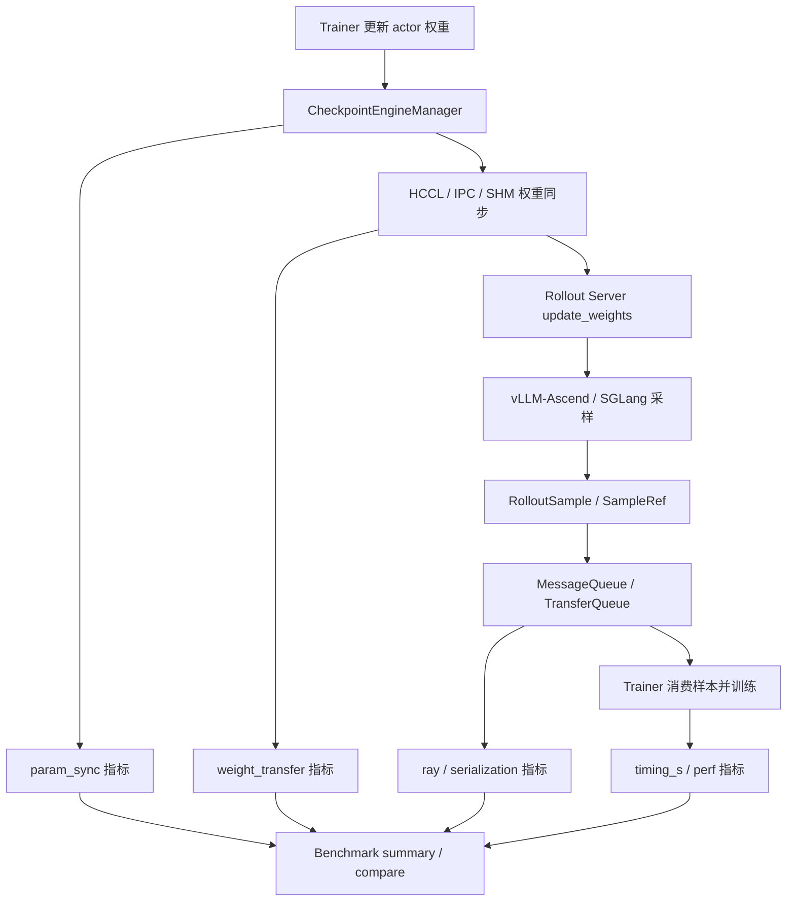
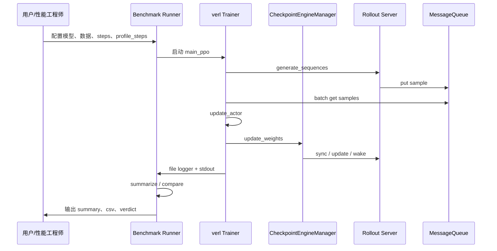

# verl Ascend 推理优化需求与方案设计补充

基于最终设计文档《verl Ascend 支持版本推理优化代码级设计文档》整理。本文聚焦需求、场景、方案、可靠性和测试建议，用于补充正式设计文档的产品化表达。

## 1. 需求分析

### 1.1 需求背景

verl 在 RLHF / GRPO / PPO 等大模型强化学习训练场景中，需要同时调度训练、推理采样、奖励计算、权重同步和样本回流等多条链路。对于 Ascend NPU 环境，当前支持基线已经具备 vLLM-Ascend、HCCL checkpoint engine、bucketed IPC / shared memory 权重传输、Ray WorkerGroup 和 fully_async policy 等基础能力，但在推理性能优化视角下仍存在几个明显问题：

1. 权重同步链路对推理采样存在全局暂停。
   当前 `CheckpointEngineManager.update_weights()` 会串行执行 `abort_all_requests -> sleep -> build_process_group -> send/receive/update -> finalize -> wake -> resume_generation`。这保证了正确性，但会把权重同步、通信、推理引擎暂停、KV cache 释放和恢复等成本全部暴露到端到端 step 时间中。

2. Ascend HCCL 后端存在可用性问题。
   当前基线中 `HCCLCheckpointEngine` 实际注册为 `"nccl"`，而配置和文档都期望存在 `"hccl"` backend。这会导致 `backend=hccl` 无法正确命中 HCCL engine，也会影响后续所有基于 HCCL 的优化。

3. 现有 IPC / SHM 权重传输缺少可观测性。
   vLLM rollout 已经根据环境能力选择 IPC 或 shared memory fallback，但当前缺少 bucket 数、传输字节数、metadata 成本、sender copy 成本、receiver clone / to(device) 成本等指标，无法判断瓶颈是否来自通信、拷贝、序列化还是推理引擎更新。

4. fully_async 样本回流路径存在 Ray RPC 和 cloudpickle 压力。
   `MessageQueue` 是单 Ray Actor，trainer 端逐样本 `get_sample_sync()` 拉取，rollouter 端整样本 `cloudpickle.dumps()`，trainer 端再逐样本 `cloudpickle.loads()`。在大量短样本、长 response 或多 rollout replica 场景下，Ray actor mailbox、GCS、CPU 序列化和 object store 都可能成为瓶颈。

5. 现有设计缺少统一 benchmark 来证明优化收益。
   仅看训练日志中的 `timing_s/step` 只能判断整体变快或变慢，不能解释收益来自 MessageQueue、权重同步、IPC 传输、序列化还是 NPU 算子侧。因此需要构建可重复的 Ascend 耗时拆解 benchmark，支撑 baseline / patched 对比。

### 1.2 需求价值

本需求的核心价值是把 verl Ascend 场景中的推理性能优化从“经验判断”推进到“可度量、可回退、可持续迭代”的工程体系。

1. 提升推理采样吞吐。
   通过减少权重同步期间的推理暂停、降低 Ray RPC 次数、降低样本序列化成本，可以提升 rollout 生成链路的有效吞吐。

2. 降低大模型权重同步开销。
   对 HCCL / IPC / SHM 权重传输做分段打点和后续优化后，可以明确优化 bucket 传输、metadata 编码、receiver copy、process group 构建等子环节。

3. 降低 Ray 调度和队列压力。
   通过 MessageQueue 批量化、后续分片化以及 TransferQueue / SampleRef 设计，可以减少大量短生命周期 RPC 对 Ray GCS 和单 actor mailbox 的压力。

4. 提供可证明的优化收益。
   通过统一 benchmark 输出 `summary.json`、`timing_breakdown.csv` 和 `compare.json`，可以对每个优化点给出 baseline / patched 的 mean、p50、p95、speedup 和 verdict。

5. 控制生产风险。
   设计中保留默认保守路径，例如 `abort_all` 权重同步策略、shared memory fallback、prefix cache 默认清理、同步失败回退到旧权重版本等，避免为了性能破坏训练正确性。

### 1.3 需求目标

本需求目标分为近期落地目标和中长期演进目标。

近期目标：

1. 修复 HCCL backend 注册问题，保证 Ascend 权重同步链路可正确启用。
2. 为权重同步链路补充分段耗时指标，包括 abort、sleep、build process group、send/receive update、finalize、wake、resume。
3. 为 bucketed weight transfer 增加 sender / receiver 侧指标，包括 bucket 数、字节数、metadata 时间、copy 时间、sync 时间。
4. 在 fully_async MessageQueue 中实现批量 `get_samples(max_n)`，降低 trainer 端逐样本 Ray RPC 开销。
5. 在 fully_async trainer 中记录 queue get RPC 次数和 cloudpickle load 时间。
6. 构建 Ascend timing breakdown benchmark，支持单次运行、结果汇总和 baseline / patched 对比。

中长期目标：

1. 将权重同步从 `abort_all` 演进到 `drain_then_commit`，再演进到 `prefetch_then_commit`。
2. 对 MessageQueue 做分片，降低单 actor 瓶颈。
3. 引入 SampleRef + TransferQueue，把大 tensor 字段从 Ray cloudpickle 数据面中移出。
4. 研究 ACL IPC handle 在通信 buffer 上的可行性，为长期零拷贝权重共享提供技术判断。
5. 联合 vLLM-Ascend / SGLang 验证 prefix / KV cache version 化策略，减少权重同步后的 cache 冷启动损失。

## 2. 场景分析

### 2.1 Use Case 分析

#### Use Case 1：Ascend 环境运行常规 GRPO / PPO 训练

用户在 Ascend NPU 集群上运行 verl GRPO / PPO 训练，使用 vLLM-Ascend 作为 rollout engine，训练侧定期把 actor 权重同步到 rollout 侧。

关注点：

- 每个 training step 的端到端耗时。
- rollout generation 耗时。
- actor update 耗时。
- 权重同步耗时。
- 参数同步是否导致 rollout 长时间暂停。

本方案提供：

- `timing_s/step`、`timing_s/gen`、`timing_s/update_actor`、`timing_s/update_weights` 等 L0 指标。
- `param_sync/*` 分阶段指标。
- Ascend NPU profiler 抽样能力。

#### Use Case 2：推理性能团队验证某个框架优化是否有效

性能团队做了某个 patch，例如 MessageQueue 批量 get、bucket metadata 优化、权重同步策略优化，希望验证收益。

关注点：

- baseline / patched 是否在相同实验参数下可比。
- 端到端 throughput 是否提升。
- 具体收益来自哪个子模块。
- 是否引入 tail latency 或 p95 回退。

本方案提供：

- `scripts/bench_ascend_verl_timing.py run` 固定实验参数并落盘。
- `summarize` 生成 `summary.json` 和 `timing_breakdown.csv`。
- `compare` 生成 baseline / patched 对比和优化 verdict。

#### Use Case 3：fully_async 短样本高并发采样

用户启用 fully_async policy，rollouter 持续生成样本并写入 MessageQueue，trainer 异步消费样本并更新 actor。

关注点：

- trainer 端等待样本时间。
- MessageQueue RPC 次数。
- Ray actor mailbox 和 GCS 压力。
- cloudpickle 序列化 / 反序列化成本。
- stale sample 比例。

本方案提供：

- `get_samples(max_n)` 批量消费接口。
- `fully_async/message_queue_get_rpc_count` 指标。
- `fully_async/cloudpickle_load_time` 指标。
- 后续可扩展 queue shard 和 SampleRef / TransferQueue。

#### Use Case 4：同节点权重传输链路调优

训练和推理进程部署在同一节点，rollout 侧通过 IPC 或 shared memory fallback 接收权重。

关注点：

- 当前实际走 IPC 还是 SHM。
- bucket 数量和总字节数。
- sender copy 时间。
- receiver clone / to(device) 时间。
- metadata 编解码时间。

本方案提供：

- `BucketedWeightSender.stats`
- `BucketedWeightReceiver.stats`
- `weight_transfer/*` 指标解析。

### 2.2 约束与限制

1. Ascend 支持版本必须以实际 recipe 固定 commit 为准。
   当前设计基线是 `verl-project/verl@4045d67063052dcb800c918c107b8d5a87046006`，不能直接把 GitHub main 当成 Ascend 支持版本。

2. NPU stream 完全重叠不能直接承诺。
   当前 HCCL engine 虽然有双 buffer，但 `BroadcastOperation` 实际同步执行 ZMQ metadata 和 `pyhccl.broadcast()`，且存在 `torch.npu.synchronize()`。是否能绑定独立 NPU stream 需要 profile 和 pyhccl 能力验证。

3. 同节点长期零拷贝权重共享不能作为近期生产承诺。
   当前已有的是 bucket IPC 传输，不是推理进程长期挂载训练权重。receiver 侧仍可能 `clone()` 或 `.to(device)`，推理引擎仍拥有自己的权重副本。

4. TransferQueue 在当前 commit 中主要是外部集成入口。
   本地没有完整 in-tree `verl/experimental/transfer_queue` 实现，不能假设当前代码已经具备完整 TransferQueue 能力。

5. Prefix / KV cache 保留策略正确性敏感。
   权重版本变化后复用旧 KV / prefix cache 可能产生跨权重版本污染。默认必须保持保守清理策略，只有在 cache key 包含 weight version 并通过正确性验证后才能放开。

6. Benchmark 的真实收益必须在 Ascend 环境验证。
   本地 CPU 测试只能验证 parser、CLI、dry-run 和局部逻辑，不能代替真实 NPU 端到端训练。

## 3. 方案设计

### 3.1 整体方案设计

整体方案采用“可观测性先行、低风险优化优先、异步化分阶段推进”的设计原则。

整体架构分为五层：

1. 基线修正层。
   修复 HCCL registry，保证 `backend=hccl` 能命中正确 checkpoint engine，并增加重复注册告警，避免 NCCL / HCCL backend 静默覆盖。

2. 指标采集层。
   在权重同步、bucketed transfer、fully_async queue、cloudpickle load 等关键路径增加 L1 指标。指标通过 file logger、stdout log 和 benchmark parser 统一汇总。

3. 低风险优化层。
   先实现 MessageQueue 批量 get、权重同步分段计时、bucket transfer 统计等不改变训练语义的优化和观测能力。

4. 权重同步策略层。
   在默认 `abort_all` 不变的前提下，后续引入 `drain_then_commit` 和 `prefetch_then_commit`。通过版本状态机控制权重新鲜度和 commit 边界。

5. Benchmark 验证层。
   通过 Ascend timing breakdown benchmark 对 baseline / patched 做 A/B 对比，输出 `summary.json`、`timing_breakdown.csv` 和 `compare.json`，支撑性能收益归因。

核心数据流：



### 3.2 影响分析

#### 对训练正确性的影响

P0 / P1 中的 registry 修复、指标打点、MessageQueue 批量 get 不改变训练数学语义。批量 get 只减少 RPC 次数，不改变样本内容和顺序语义。

`drain_then_commit` 和 `prefetch_then_commit` 会引入权重版本边界，需要控制 staleness。必须保证：

- 样本携带 `param_version`。
- trainer 消费样本时检查 stale 阈值。
- commit 失败时不切换到半更新权重。
- 同一 prompt group 的多 response 尽量保持版本一致，避免影响 GRPO group normalization。

#### 对推理服务的影响

权重同步策略优化会改变 rollout server 的暂停方式：

- 当前 `abort_all` 安全但会中断请求并清 cache。
- `drain_then_commit` 会降低中断概率，但需要等待 in-flight 请求 drain。
- `prefetch_then_commit` 会缩短最终 commit 停顿，但需要额外缓存和版本状态机。

#### 对资源消耗的影响

指标采集成本较低，但 NPU profiler 会影响运行时性能，因此只应在少量 step 抽样。

prefetch / cache 方案可能增加 HBM 或 CPU pinned memory 占用。默认应限制：

- `max_cached_versions=1`
- bucket 级缓存
- 缓存失败自动释放

#### 对运维和定位的影响

新增 benchmark 和指标会显著降低定位成本。后续线上问题可以判断瓶颈属于：

- Ray / MessageQueue
- cloudpickle / serialization
- HCCL / IPC transfer
- rollout server update
- vLLM-Ascend generation
- actor update

### 3.3 Use Case 设计

#### 3.3.1 交互分析

主要交互对象包括：

1. 算法 / 训练用户。
   通过 Hydra 参数选择 rollout engine、checkpoint backend、同步策略和 benchmark 参数。用户关注训练是否跑通、吞吐是否提升、结果是否稳定。

2. 推理性能优化工程师。
   通过 benchmark runner 跑 baseline / patched，对比 L0 / L1 / L2 指标，判断优化是否有效。

3. Rollout server。
   接收权重更新、生成样本、处理 pause / resume / abort / commit 指令。

4. CheckpointEngineManager。
   负责训练侧和 rollout 侧权重同步编排，是权重同步策略的核心入口。

5. MessageQueue / TransferQueue。
   负责样本从 rollouter 到 trainer 的回流，是 fully_async 场景下的关键数据面。

典型交互流程：



#### 3.3.2 功能原理

1. HCCL backend 修复。
   将 `HCCLCheckpointEngine` 注册 key 从 `"nccl"` 修正为 `"hccl"`，使配置中的 `backend=hccl` 能正确实例化 HCCL engine。

2. 权重同步分段计时。
   在 `CheckpointEngineManager.update_weights()` 内部围绕每个阶段记录耗时，形成 `param_sync/*` 指标。这样可以判断同步慢是因为 abort、sleep、process group、send/recv、finalize 还是 wake/resume。

3. Bucketed transfer 指标。
   sender 记录 bucket 数、总字节数、copy 时间、metadata send 时间、sync 时间；receiver 记录 metadata recv 时间、clone / to(device) 时间、bucket bytes 和 sync 时间。

4. MessageQueue 批量 get。
   原 trainer 每次从 Ray actor 拉一个 sample，改为一次拉最多 `max_n` 个 sample。队列为空时最多等待 timeout，队列关闭时返回 `None`，遇到 `None` sentinel 时保持原终止语义。

5. Benchmark 汇总与对比。
   benchmark runner 通过 file logger 收集 `timing_s/*`、`perf/*`、`fully_async/*` 等指标，通过 stdout 解析 `param_sync/*` 和 `weight_transfer/*` 指标，生成 summary 和 compare。compare 根据指标方向判断 speedup 和 effective verdict。

#### 3.3.3 Story / Task 分解

Story 1：作为 Ascend verl 用户，我希望 `backend=hccl` 能正确启动，使 HCCL 权重同步链路可用。

Task：

- 修正 `HCCLCheckpointEngine` registry。
- 增加 registry 覆盖 warning。
- 增加 CPU 可执行源码测试或 NPU smoke test。

Story 2：作为性能工程师，我希望看到权重同步各阶段耗时，定位同步瓶颈。

Task：

- 在 `CheckpointEngineManager.update_weights()` 增加分段 timer。
- 将 `last_update_weights_timing` 写入训练 metrics。
- 在 benchmark parser 中聚合 `param_sync/*`。

Story 3：作为性能工程师，我希望知道权重传输走 IPC 还是 SHM，以及每个 bucket 的 copy / metadata 成本。

Task：

- 给 `BucketedWeightSender` 增加 stats。
- 给 `BucketedWeightReceiver` 增加 stats。
- 在 stdout parser 中解析 sender / receiver stats。

Story 4：作为 fully_async 用户，我希望 trainer 批量消费样本，减少 Ray RPC 开销。

Task：

- 给 `MessageQueue` 增加 `get_samples(max_n, timeout_ms)`。
- 给 `MessageQueueClient` 增加同步 / 异步批量接口。
- 修改 `FullyAsyncTrainer._get_samples_from_queue()` 使用批量 get。
- 增加 `message_queue_get_rpc_count` 和 `cloudpickle_load_time` 指标。

Story 5：作为优化验证负责人，我希望有统一 benchmark 证明每个 patch 的收益。

Task：

- 新增 `scripts/bench_ascend_verl_timing.py`。
- 新增 Ascend 一键脚本 `tests/special_npu/run_ascend_timing_breakdown_bench.sh`。
- 支持 `run / summarize / compare`。
- 输出 `summary.json`、`timing_breakdown.csv`、`compare.json`。

Story 6：作为后续优化开发者，我希望可以逐步演进到异步权重同步。

Task：

- 设计 `sync_policy: abort_all | drain_then_commit | prefetch_then_commit`。
- 第一阶段实现 `drain_then_commit`。
- 第二阶段实现 `HCCLCachedCheckpointEngine` 和 `prefetch / commit`。
- 引入 `param_version` 和 stale sample 控制。

## 4. 可靠可用设计

### 4.1 冗余设计

1. 同步策略冗余。
   默认保留当前 `abort_all` 路径。`drain_then_commit` 和 `prefetch_then_commit` 都必须作为可配置策略启用，出现异常时可回退到 `abort_all`。

2. 通信路径冗余。
   vLLM rollout 当前已支持 IPC 和 shared memory fallback。优化 IPC 传输时不能移除 SHM fallback；当 Ascend IPC 环境不满足要求时，系统应自动退回 SHM 并输出 `weight_transfer/path=shm`。

3. 权重版本冗余。
   prefetch 阶段不能覆盖当前已 commit 权重。只有新版本完整接收并进入 READY 状态后才允许 commit。commit 失败时继续使用旧版本。

4. benchmark 数据冗余。
   同时保留 file logger 和 stdout log。即使部分 metrics 未进入 file logger，也可以从 stdout 中解析权重同步和 bucket transfer 统计。

5. profiler 冗余。
   NPU profiler 只作为 L2 抽样证据，不依赖 profiler 才能完成 benchmark。即使 profiler 失败，L0 / L1 指标仍应可用。

### 4.2 防呆设计

1. backend 防呆。
   registry 重复注册时输出 warning，避免 HCCL / NCCL backend 被静默覆盖。

2. 配置防呆。
   `sync_policy` 默认使用 `abort_all`。高风险策略如 `prefetch_then_commit`、prefix cache version 化、ACL IPC PoC 都必须显式开启。

3. 队列防呆。
   `get_samples(max_n)` 要校验 `max_n > 0`。队列关闭且为空时返回 `None`，保留原终止语义。遇到 `None` sentinel 时停止本次批量 pop，避免吞掉终止信号后的样本。

4. 版本防呆。
   stale threshold 必须可配置，超过阈值的样本不能无条件进入训练。对于 GRPO 多 response per prompt，需要避免同一 prompt group 内混用过多权重版本。

5. 内存防呆。
   cached weights 默认只保留最新一个版本，bucket buffer 必须有生命周期释放。大 tensor 分片不能无限制重组导致峰值翻倍。

6. benchmark 防呆。
   benchmark runner 支持 dry-run，先打印实际 verl 命令、输出路径和 env，用户可确认后再跑真实训练。summary 对缺失字段应跳过而不是失败。

7. profiler 防呆。
   默认只 profile 少量 step，避免 profiler 对性能数据造成过大扰动。profile step 应避开 warmup step。

## 5. 测试建议

### 5.1 单元测试

1. HCCL registry 测试。
   验证 HCCL backend 注册为 `"hccl"`，且不会覆盖 `"nccl"`。

2. MessageQueue 批量 get 测试。
   覆盖：
   - 正常批量返回。
   - timeout 返回空 batch。
   - `None` sentinel 终止语义。
   - shutdown 后返回 `None`。
   - `max_n <= 0` 抛错。

3. Bucketed transfer stats schema 测试。
   验证 sender / receiver 默认 stats 字段完整，避免指标 key 被误删。

4. Benchmark parser 测试。
   构造 fake `metrics.jsonl` 和 `stdout.log`，验证：
   - `timing_s/*` 聚合。
   - `param_sync/*` 解析。
   - `weight_transfer/*` 解析。
   - mean / p50 / p95 / pct_of_step_mean 正确。

5. Compare 测试。
   构造 baseline / patched summary，验证 speedup、delta、effective verdict 正确。

### 5.2 开发者本地测试

本地无 Ascend 环境时建议执行：

```bash
python -m py_compile \
  scripts/bench_ascend_verl_timing.py \
  verl/checkpoint_engine/base.py \
  verl/checkpoint_engine/hccl_checkpoint_engine.py \
  verl/workers/rollout/vllm_rollout/bucketed_weight_transfer.py \
  verl/experimental/fully_async_policy/message_queue.py \
  verl/experimental/fully_async_policy/fully_async_trainer.py \
  verl/trainer/ppo/ray_trainer.py
```

```bash
python -m pytest \
  tests/special_sanity/test_ascend_timing_benchmark.py \
  tests/checkpoint_engine/test_registry_on_cpu.py \
  tests/experimental/fully_async_policy/test_message_queue_on_cpu.py \
  tests/experimental/fully_async_policy/test_message_queue_benchmark_on_cpu.py \
  tests/utils/test_bucketed_weight_transfer.py \
  -q
```

```bash
bash -n tests/special_npu/run_ascend_timing_breakdown_bench.sh
```

```bash
MODEL_PATH=/models/qwen \
TRAIN_FILES=/data/train.parquet \
VAL_FILES=/data/test.parquet \
OUTPUT_DIR=/tmp/ascend_bench_dry_run \
bash tests/special_npu/run_ascend_timing_breakdown_bench.sh --dry-run
```

### 5.3 Ascend 集成测试

在 Ascend 环境执行：

```bash
MODEL_PATH=/path/to/model \
TRAIN_FILES=/path/to/train.parquet \
VAL_FILES=/path/to/test.parquet \
OUTPUT_DIR=outputs/ascend_timing_breakdown/baseline \
bash tests/special_npu/run_ascend_timing_breakdown_bench.sh
```

检查输出：

- `metrics.jsonl` 存在且包含 `timing_s/*` 和 `perf/*`。
- `summary.json` 存在且 `step_count > 0`。
- `timing_breakdown.csv` 存在且包含 `timing_s/step`。
- `stdout.log` 中包含 checkpoint 或 bucket transfer 统计。
- `npu_profile/` 在配置了 `PROFILE_STEPS` 时有采集文件。

### 5.4 A/B 性能测试

同一环境、同一模型、同一数据、同一 step 数，分别跑 baseline 和 patched：

```bash
python scripts/bench_ascend_verl_timing.py compare \
  --baseline-summary outputs/ascend_timing_breakdown/baseline/summary.json \
  --patched-summary outputs/ascend_timing_breakdown/patched/summary.json \
  --output outputs/ascend_timing_breakdown/compare.json
```

重点验收：

- `perf/throughput` 提升。
- `timing_s/step` 下降。
- 目标优化点对应指标改善，例如：
  - MessageQueue 优化看 `ray/message_queue_get_rpc_count`。
  - 权重同步优化看 `param_sync/send_recv_update_ms` 和 `timing_s/update_weights`。
  - bucket transfer 优化看 `weight_transfer/sender_copy_ms`、`weight_transfer/receiver_copy_ms`。
  - 序列化优化看 `serialization/cloudpickle_load_s`。

### 5.5 正确性回归测试

性能优化不能只看耗时，还需要验证训练行为未被破坏：

1. 单 step smoke test 能完成。
2. 多 step GRPO / PPO loss、reward、KL 指标无异常 NaN / Inf。
3. 权重同步后 rollout 能继续生成。
4. fully_async 模式下 stale sample 比例符合阈值。
5. 启用优化和关闭优化时，样本字段完整性一致。

### 5.6 压力测试

建议至少覆盖：

- 小模型：Qwen2.5-0.5B，用于快速回归。
- 中模型：Qwen2.5-7B / Qwen3-8B，用于真实吞吐观察。
- 长 response：提高 `max_response_length`，观察 decode 和 queue 压力。
- 高 rollout_n：观察 MessageQueue 和样本序列化压力。
- 多节点：观察 Ray GCS、HCCL process group 和权重同步稳定性。

